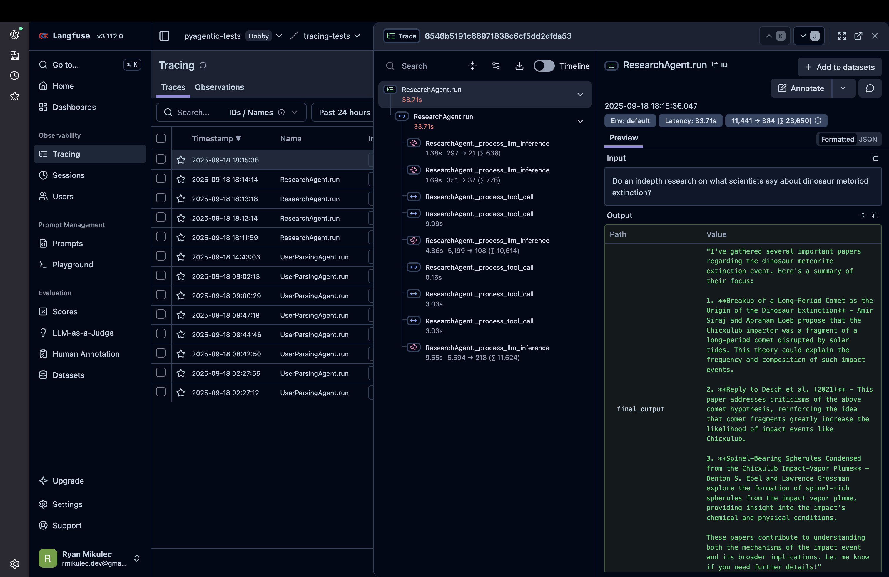

# Observability

PyAgentic provides built-in observability through tracing, allowing you to monitor and understand how your agents work. This guide covers the basics of tracing and how to set up different tracers.

## What are Traces?

Traces help you observe the execution flow of your agents by recording what happens during agent runs. A trace represents a complete execution path, made up of individual spans that capture specific operations.

Think of a trace like a detailed log of everything your agent does:
- When it starts thinking about a problem
- When it calls tools or external services
- When it makes inference calls to language models
- When it finishes a task

## Span Types

PyAgentic supports four types of spans to categorize different operations:

- **Agent spans** (`SpanKind.AGENT`): Track high-level agent operations and workflows
- **Tool spans** (`SpanKind.TOOL`): Monitor tool executions and external API calls
- **Inference spans** (`SpanKind.INFERENCE`): Capture language model interactions and generations
- **Step spans** (`SpanKind.STEP`): Record individual steps within larger operations

Each span captures timing information, attributes, and can include events for detailed logging.

## Available Tracers

PyAgentic includes two built-in tracers:

### BasicTracer
An in-memory tracer that stores traces locally in Python dictionaries. Perfect for development, testing, and simple use cases.

The BasicTracer is the simplest way to get started with tracing. It stores all trace data in memory and provides export functionality.

```python
from your_agent_module import YourAgent


# Create an agent - The BasicTracer is the default tracer of any declared agent
agent = YourAgent(
    model="openai::gpt-4o",
    api_key=MY_API_KEY,
)


# Run your agent
result = await agent("Your task here")
```

#### BasicTracer Features

- **In-memory storage**: All data stored locally, no external dependencies
- **Export functionality**: Get trace data as JSON for analysis or debugging
- **Thread-safe**: Safe to use with concurrent operations
- **Reset option**: Clear traces after export to manage memory usage

```python
# Export a specific trace and clear it from memory
trace_data = tracer.export_trace(trace_id, reset=True)

# Clear all stored traces
tracer.clear()
```


### LangfuseTracer
Integrates with [Langfuse](https://langfuse.com) for production-grade observability with advanced analytics, dashboards, and collaboration features.

The LangfuseTracer provides enterprise-grade observability by forwarding traces to Langfuse.

#### Setup

First, install the Langfuse SDK:

```bash
pip install langfuse
```

Configure your Langfuse connection using environment variables:

```bash
export LANGFUSE_SECRET_KEY="your-secret-key"
export LANGFUSE_PUBLIC_KEY="your-public-key"
export LANGFUSE_HOST="https://cloud.langfuse.com"  # or your self-hosted instance
```

#### Usage

```python
from pyagentic.tracing import LangfuseTracer
from your_agent_module import YourAgent

# Create an agent with the tracer
agent = YourAgent(
    model="openai::gpt-4o",
    api_key=MY_API_KEY,
    tracer=LangfuseTracer()
)

# Run your agent - traces will be sent to Langfuse
result = await agent("Your task here")
```

#### LangfuseTracer Features

- **Real-time streaming**: Traces sent to Langfuse as they happen
- **Rich UI**: View traces in the Langfuse dashboard with advanced filtering and analytics
- **Cost tracking**: Automatic LLM usage and cost monitoring
- **Collaboration**: Share traces with team members
- **Production-ready**: Built for high-volume production workloads



## Choosing a Tracer

**Use BasicTracer when:**
- Developing and testing agents locally
- Simple debugging scenarios
- No external dependencies desired
- Working with sensitive data that must stay local

**Use LangfuseTracer when:**
- Running agents in production
- Need advanced analytics and monitoring
- Want to share traces with team members
- Require cost tracking and optimization insights
- Building user-facing applications