# Policies

Policies are powerful hooks that react to state changes in your agents. They allow you to validate data, track history, persist changes, trigger side effects, and implement complex reactive behaviors - all without cluttering your tool implementations.

## Why Use Policies?

Without policies, you'd need to manually handle validation, logging, persistence, and other cross-cutting concerns in every tool that modifies state. Policies centralize these behaviors and reduce the need for manually typing Getter / Setter tools.

Lets say you have an Agent that is able to trigger multiple methods with complex score logic. In this
example, the user would likely have to create a seperate method just for adjusting the score, then use
that method each time it wants to change the score

**Without policies - repetitive and error-prone**
```python
class TextAdventureAgent(BaseAgent):
    ...
    def set_score(self, new_score: int) -> str:
        # Validation
        if not 0 <= new_score <= 100:
            raise ValueError("Score must be 0-100")

        # History tracking
        self.score_history.append({
            "old": self.score,
            "new": new_score,
            "timestamp": datetime.now()
        })

        # Persistence
        with open("scores.json", "w") as f:
            json.dump({"score": new_score}, f)

        # Finally, the actual update
        self.score = new_score
        return f"Score updated to {new_score}"
    
    @tool("Call when the user decieds to pick an item up")
    def pickup_item(self, item: str):
        ...
        self.set_score(new_score)
        ...
    
    @tool("Call when the user defeats an enemy")
    def defeat_enemy(self, enemy: str):
        ...
        self.set_score(new_score)
        ...
```
**With policies - clean and declarative**

Rather than injecting this custom logic as a new function, they can instead declare policies on the
`score` state variable itself and then just use it as is in any tool. This simplifies the code in
the agent itself while *always* enforcing the validation steps, allowing less mistakes.

```python
class ScoreValidationPolicy(Policy[int]):
    def on_set(self, event, value: int) -> int:
        if not 0 <= value <= 100:
            raise ValueError("Score must be 0-100")
        return value

class ScoreHistoryPolicy(Policy[int]):
    def __init__(self):
        self.history = []

    def on_set(self, event, value: int) -> int:
        self.history.append({
            "old": event.previous,
            "new": value,
            "timestamp": event.timestamp
        })
        return value

class GameAgent(BaseAgent):
    score: State[int] = spec.State(
        default=0,
        access="write" # Automatically creates a `set_score` tool
        policies=[
            ScoreValidationPolicy(),
            ScoreHistoryPolicy()
        ]
    )

    @tool("Call when the user decieds to pick an item up")
    def pickup_item(self, item: str):
        ...
        self.score = new_score
        ...
    
    @tool("Call when the user defeats an enemy")
    def defeat_enemy(self, enemy: str):
        ...
        self.score = new_score
        ...
```

## How Policies Work

Policies implement the `Policy` protocol and define handlers for state events:

### The Policy Protocol

```python
class Policy(Protocol[T]):
    """Base interface for all State policies."""

    def on_get(self, event: GetEvent, value: T) -> T | None:
        """Synchronous handler when state is read"""
        ...

    async def background_get(self, event: GetEvent, value: T) -> T | None:
        """Async handler when state is read (runs in background)"""
        ...

    def on_set(self, event: SetEvent, value: T) -> T | None:
        """Synchronous handler when state is written"""
        ...

    async def background_set(self, event: SetEvent, value: T) -> T | None:
        """Async handler when state is written (runs in background)"""
        ...
```

### Event Types

Policies receive event objects with contextual information:

**`GetEvent`** - Triggered when state is read:
```python
@dataclass
class GetEvent:
    name: str           # Field name being accessed
    value: Any          # Current value
    timestamp: datetime # When the access occurred
```

**`SetEvent`** - Triggered when state is written:
```python
@dataclass
class SetEvent:
    name: str           # Field name being modified
    previous: Any       # Value before change
    value: Any          # New value being set
    timestamp: datetime # When the change occurred
```

### Handler Execution

When state is accessed or modified, PyAgentic runs policies in order:

1. **`on_get` / `on_set`**: Synchronous handlers run immediately
   - Can transform the value by returning a new value
   - Can validate by raising exceptions
   - Blocks until complete

2. **`background_get` / `background_set`**: Async handlers run concurrently
   - Execute in the background without blocking
   - Perfect for logging, persistence, notifications
   - Can also transform values (applied asynchronously)

#### Execution Flow Diagram

```mermaid
flowchart TD
    Start[State Access/Modification] --> Type{Access Type?}

    Type -->|GET| GetRetrieve[1. Retrieve stored value]
    Type -->|SET| SetGetPrev[1. Get previous value]

    GetRetrieve --> GetSync[2. Run on_get for each policy<br/>⏱️ BLOCKS until complete]
    SetGetPrev --> SetSync[2. Run on_set for each policy<br/>⏱️ BLOCKS until complete]

    GetSync --> GetTransform{Policies returned<br/>new value?}
    SetSync --> SetValidate{Policy raised<br/>error?}

    SetValidate -->|Yes| SetError[❌ Raise error<br/>State unchanged]
    SetValidate -->|No| SetTransform{Policies returned<br/>new value?}

    GetTransform -->|Yes| GetNewVal[Use transformed value]
    GetTransform -->|No| GetOldVal[Use original value]
    SetTransform -->|Yes| SetNewVal[3. Store new value]
    SetTransform -->|No| SetOldVal[3. Store value as-is]

    GetNewVal --> GetBg[4. Launch background_get tasks<br/>🔄 Runs async in background]
    GetOldVal --> GetBg
    SetNewVal --> SetBg[4. Launch background_set tasks<br/>🔄 Runs async in background]
    SetOldVal --> SetBg

    GetBg --> GetReturn[5. Return value to caller]
    SetBg --> SetReturn[5. Return success]

    GetReturn --> End[✓ Complete]
    SetReturn --> End
    SetError --> End

    style GetSync fill:#e1f5ff
    style SetSync fill:#ffe1e1
    style GetBg fill:#d4edda
    style SetBg fill:#d4edda
    style SetError fill:#ffcccc
```



**Key timing details:**

- **Sync handlers (`on_get` / `on_set`)** run BEFORE the value is returned/stored and BLOCK the operation
  - Use for: validation, transformation, access control
  - Perfect for preventing invalid state
- **Background handlers (`background_get` / `background_set`)** run AFTER sync handlers complete and DON'T block
  - Use for: logging, persistence, notifications, analytics
  - Cannot prevent the operation (already completed)

## Combining Multiple Policies

Policies execute in the order they're defined, creating a transformation pipeline:

```python
class RangeValidationPolicy:
    def __init__(self, min_val, max_val):
        self.min_val = min_val
        self.max_val = max_val

    def on_set(self, event, value):
        if not self.min_val <= value <= self.max_val:
            raise ValueError(f"Value must be between {self.min_val} and {self.max_val}")
        return value

class HistoryTrackingPolicy:
    def __init__(self, max_length=100):
        self.max_length = max_length
        self.history = []

    def on_set(self, event, value):
        self.history.append({
            "old": event.previous,
            "new": value,
            "timestamp": event.timestamp.isoformat()
        })
        if len(self.history) > self.max_length:
            self.history.pop(0)
        return value

class SQLPersistencePolicy:
    def __init__(self, table: str):
        self.table = table

    async def background_set(self, event, value):
        # Run async to avoid blocking
        await sql.sync_to_db(value)

class Agent(BaseAgent):
    score: State[int] = spec.State(
        default=0,
        policies=[
            RangeValidationPolicy(0, 100),
            HistoryTrackingPolicy(max_length=50),
            SQLPersistencePolicy("Scores")
        ]
    )
```

**Execution flow when LLM sets an invalid value:**


**Key insights:**

- When you write `self.score = <score>` in a tool, AgentState automatically creates a SetEvent
- Policies receive the event with the previous and new values
- If a policy raises an error, it propagates back to the LLM as a tool error message
- The LLM sees the error and can retry with a corrected value
- This creates a feedback loop that helps the LLM learn and respect your state constraints

**Why policies are essential safeguards:**

LLMs are probabilistic and can make mistakes - they might ignore system instructions, misunderstand tool definitions, or hallucinate invalid values. Policies provide a **hard constraint layer** that protects your state regardless of what the LLM does:

- **System instructions are soft** - The LLM might say "score must be 0-100" but still try 150
- **Tool definitions are guidance** - Parameter descriptions can be ignored or misinterpreted
- **Policies are enforcement** - Validation always runs, guaranteeing state integrity

Even with perfect prompts, policies ensure your application never enters an invalid state. They're your last line of defense against LLM unpredictability.

## Creating Custom Policies

Build your own policies by implementing the `Policy` protocol. You only need to implement the methods you use.

**When to use each handler:**

- **`on_get` / `on_set`**: Validation, transformation, sync operations (blocks until complete)
- **`background_get` / `background_set`**: Async I/O, logging, notifications (runs in background)

### Example 1: Validation

Reject invalid values by raising exceptions:

```python
class RangeValidationPolicy:
    def __init__(self, min_val, max_val):
        self.min_val = min_val
        self.max_val = max_val

    def on_set(self, event, value):
        if not self.min_val <= value <= self.max_val:
            raise ValueError(f"Value must be between {self.min_val} and {self.max_val}")
        return None

# Usage
class GameAgent(BaseAgent):
    score: State[int] = spec.State(
        default=0,
        policies=[RangeValidationPolicy(0, 100)]
    )
```

### Example 2: Transformation

Transform values as they're set or retrieved:

```python
class UppercasePolicy:
    def on_set(self, event, value: str) -> str:
        return value.upper()  # Store as uppercase

class Agent(BaseAgent):
    name: State[str] = spec.State(
        default="",
        policies=[UppercasePolicy()]
    )

# Usage
agent.name = "john"
print(agent.name)  # "JOHN"
```

### Example 3: Async Persistence

Save state changes without blocking:

```python
import json
from pathlib import Path

class JSONPersistencePolicy:
    def __init__(self, filepath: str):
        self.filepath = Path(filepath)


    async def background_set(self, event, value):
        # Write to file asynchronously
        data = {
            "timestamp": event.timestamp.isoformat(),
            "field": event.name,
            "value": value
        }
        existing = []
        if self.filepath.exists():
            existing = json.loads(self.filepath.read_text())

        existing.append(data)
        self.filepath.write_text(json.dumps(existing, indent=2))
        return None


# Usage
class DocumentAgent(BaseAgent):
    content: State[str] = spec.State(
        default="",
        policies=[JSONPersistencePolicy("history.json")]
    )
```

## Combining Policies

Chain multiple policies together - they execute in order:

```python
class TrimPolicy:
    def on_set(self, event, value: str) -> str:
        return value.strip()

class LowercasePolicy:
    def on_set(self, event, value: str) -> str:
        return value.lower()

class Agent(BaseAgent):
    username: State[str] = spec.State(
        default="",
        policies=[
            TrimPolicy(),        # First: trim whitespace
            LowercasePolicy()    # Then: convert to lowercase
        ]
    )

# Usage
agent.username = "  JOHN DOE  "
print(agent.username)  # "john doe"
```

## Best Practices

1. **Keep policies focused** - Each policy should do one thing well
2. **Use async for I/O** - Keep `on_get`/`on_set` fast, move I/O to `background_*` methods
3. **Order matters** - Put validation first, side effects last
4. **Handle errors gracefully** - Especially in background handlers
5. **Make policies reusable** - Use `__init__` parameters for flexibility

## Next Steps

- Learn about [State Management](states.md) to understand how policies integrate with state
- Explore [Structured Outputs](structured-output.md) for validating agent responses
- See [Agent Linking](agent-linking.md) to coordinate policies across multiple agents
