# Policies

Policies are powerful hooks that react to state changes in your agents. They let you validate data, track history, persist changes, trigger side effects, and implement reactive behaviors—without cluttering your tool implementations.

---

## Why Use Policies?

Without policies, each tool that mutates state must repeat validation, logging, persistence, and other cross-cutting concerns. Policies centralize those behaviors and reduce the need for hand-written Getter/Setter tools.

**Without policies — repetitive and error-prone**
```python
class TextAdventureAgent(BaseAgent):
    combat_score: State[int] = spec.State(default=0)      # valid 0..100
    puzzle_score: State[int] = spec.State(default=0)      # valid -20..500
    streak: State[int] = spec.State(default=0)

    @tool("Award combat points for defeating an enemy")
    def defeat_enemy(self, enemy: str, points: int = 10):
        ...
        new_score = self.combat_score + points + (2 if self.streak >= 3 else 0)
        if not isinstance(new_score, int):
            raise ValueError("Combat Score must be an integer")
        if not (0 <= new_score <= 100):
            raise ValueError("Combat Score must be between 0 and 100")

        self.combat_score = new_score
        self.streak += 1

    @tool("Award puzzle points for solving a riddle")
    def solve_puzzle(self, puzzle: str, points: int = 25):
        ...
        new_score = self.puzzle_score + points
        if not isinstance(new_score, int):
            raise ValueError("Puzzle Score must be an integer")
        if not (-20 <= new_score <= 500):
            raise ValueError("Puzzle Score must be between -20 and 500")

        self.puzzle_score = new_score
        # streak doesn’t change here
    ...
```

**With policies — clean and declarative**

Instead of repeating this logic, declare policies on the `score` state and use it naturally in any tool. Validation and side effects are always enforced.


The user could use the `BoundValuePolicy`
```python
from pyagentic.policies.core import BoundValuePolicy

class TextAdventureAgent(BaseAgent):
    combat_score: State[int] = spec.State(
        default=0,
        policies=[
            BoundValuePolicy(min_val=0, max_val=100),
        ],
    )

    puzzle_score: State[int] = spec.State(
        default=0,
        policies=[
            BoundValuePolicy(min_val=-20, max_val=500),
        ],
    )

    streak: State[int] = spec.State(default=0)

    @tool("Award combat points for defeating an enemy")
    def defeat_enemy(self, enemy: str, points: int = 10):
        ...
        # Intent only; bounds enforced by the BoundValuePolicy
        bonus = 2 if self.streak >= 3 else 0
        self.combat_score = self.combat_score + points + bonus
        self.streak = self.streak + 1

    @tool("Award puzzle points for solving a riddle")
    def solve_puzzle(self, puzzle: str, points: int = 25):
        ...
        # Intent only; bounds enforced by the BoundValuePolicy
        self.puzzle_score = self.puzzle_score + points
```

**For Background Jobs**

Policies can also be used to trigger background jobs whenever a field is modified. Take for example
an `JournalAgent`, which writes journal entries based on the conversation with the user. This Agent
may have a `Journal`, complete with `entries` and a `summary`

```python
class Journal(BaseModel):
    """A journal with entries and a running summary."""
    entries: list[str] = []
    summary: str = ""
```

The JournalAgent may then take this further by using a `SummarizePolicy` to auto summarize the entries
without needing explicit calling by the user.

```python
class JournalAgent(BaseAgent):
    """Agent that manages a journal and keeps it summarized."""
    journal: State[Journal] = spec.State(
        default_factory=Journal,
        policies=[
            SummaryPolicy(
                to_summarize='entries',
                summary_field="summary",
            )
        ]
    )

    @tool("Add a new journal entry")
    def add_entry(self, text: str):
        """
        Add a new entry to the journal.
        The SummaryPolicy automatically updates the summary afterward.
        """
        self.journal.entries.append(text)
        return f"Added entry: {text[:40]}..."
    ...
```

This would make sure that the summary attached to the journal is **always** up-to-date with the
entries. No matter if the agent adds, removes, or modifies them. 

---

## How Policies Work

Policies implement the `Policy[T]` protocol and define handlers for state events.

### Event Types

**`GetEvent`** — triggered when state is read

```python
@dataclass
class GetEvent:
    name: str           # Field name being accessed
    value: Any          # Current value
    timestamp: datetime # When the access occurred
```

**`SetEvent`** — triggered when state is written

```python
@dataclass
class SetEvent:
    name: str           # Field name being modified
    previous: Any       # Value before change
    value: Any          # New value being set
    timestamp: datetime # When the change occurred
```

### Handler Semantics

* **Synchronous (`on_get`, `on_set`)**

  * Run **before** the value is returned/stored and **block** the operation.
  * May **transform** the value by returning a replacement.
  * May **validate** by raising an exception, which aborts the operation.
  * **Ordering:** policies run in the order they’re declared; the first exception aborts, and later handlers do not run.

* **Background (`background_get`, `background_set`)**

  * Run **after** sync handlers complete and **must not** mutate stored state.
  * Intended for **side effects only**: logging, metrics, notifications, persistence.
  * Failures should be handled internally (e.g., retries/backoff); they cannot prevent an already-completed operation.

### Execution Flow

```mermaid
flowchart TD
    Start[State Access/Modification] --> Type{Access Type?}

    Type -->|GET| GetRetrieve[1. Retrieve stored value]
    Type -->|SET| SetGetPrev[1. Get previous value]

    GetRetrieve --> GetSync[2. Run on_get for each policy<br/>⏱️ BLOCKS until complete]
    SetGetPrev --> SetSync[2. Run on_set for each policy<br/>⏱️ BLOCKS until complete]

    GetSync --> GetTransform{Any handler<br/>returned new value?}
    SetSync --> SetValidate{Any handler<br/>raised error?}

    SetValidate -->|Yes| SetError[❌ Raise error<br/>State unchanged]
    SetValidate -->|No| SetTransform{Any handler<br/>returned new value?}

    GetTransform -->|Yes| GetNewVal[Use transformed value]
    GetTransform -->|No| GetOldVal[Use original value]
    SetTransform -->|Yes| SetNewVal[3. Store new value]
    SetTransform -->|No| SetOldVal[3. Store value as-is]

    GetNewVal --> GetBg[4. Launch background_get tasks<br/>🔄 Side effects only]
    GetOldVal --> GetBg
    SetNewVal --> SetBg[4. Launch background_set tasks<br/>🔄 Side effects only]
    SetOldVal --> SetBg

    GetBg --> GetReturn[5. Return value to caller]
    SetBg --> SetReturn[5. Return success]

    GetReturn --> End[✓ Complete]
    SetReturn --> End
    SetError --> End

    style GetSync fill:#e1f5ff
    style SetSync fill:#ffe1e1
    style GetBg fill:#d4edda
    style SetBg fill:#d4edda
    style SetError fill:#ffcccc
```



---

## Combining Multiple Policies

Policies compose into a pipeline. Order matters.

```python
class RangeValidationPolicy(Policy[int]):
    def __init__(self, min_val: int, max_val: int):
        self.min_val, self.max_val = min_val, max_val

    def on_set(self, event: SetEvent, value: int) -> Optional[int]:
        if not self.min_val <= value <= self.max_val:
            raise ValueError(f"Value must be between {self.min_val} and {self.max_val}")
        return None

class HistoryTrackingPolicy(Policy[int]):
    def __init__(self, max_length=100):
        self.max_length = max_length
        self.history: list[dict] = []

    def on_set(self, event: SetEvent, value: int) -> Optional[int]:
        self.history.append({
            "old": event.previous,
            "new": value,
            "timestamp": event.timestamp.isoformat()
        })
        if len(self.history) > self.max_length:
            self.history.pop(0)
        return None

class SQLPersistencePolicy(Policy[int]):
    async def background_set(self, event: SetEvent, value: int) -> None:
        await sql.sync_to_db({"field": event.name, "value": value, "ts": event.timestamp})

class Agent(BaseAgent):
    score: State[int] = spec.State(
        default=0,
        policies=[
            RangeValidationPolicy(0, 100),  # validate first
            HistoryTrackingPolicy(50),      # track second
            SQLPersistencePolicy(),         # persist last (background)
        ],
    )
```

### Invalid Value Example (sequence)

```mermaid
sequenceDiagram
    participant LLM
    participant Agent as Agent (@tool)
    participant State as AgentState
    participant Policy as RangeValidationPolicy

    Note over LLM,Policy: ❌ Attempt with invalid value

    LLM->>Agent: update_score(150)
    Agent->>State: Set score to 150
    State->>Policy: on_set(event, 150)
    Policy--xState: raise ValueError("Value must be between 0 and 100")
    State--xAgent: Error
    Agent--xLLM: Tool error

    Note over LLM,Policy: ✅ Retry with valid value

    LLM->>Agent: update_score(100)
    Agent->>State: Set score to 100
    State->>Policy: on_set(event, 100)
    Policy-->>State: return None (keep)
    State-->>Agent: ✓ Success
    Agent-->>LLM: "Score updated to 100"
```



**Key insights**

* Writing `self.score = v` creates a `SetEvent(previous, value)`.
* A policy exception aborts the write; the LLM sees a tool error and can retry.
* Background handlers cannot undo or change the committed value.

---

## Creating Custom Policies

Implement only what you need.

### Example 1: Validation

```python
class NonEmptyPolicy(Policy[str]):
    def on_set(self, event: SetEvent, value: str) -> Optional[str]:
        if not value.strip():
            raise ValueError("Value cannot be empty")
        return None
```

### Example 2: Transformation

```python
class TrimAndLowerPolicy(Policy[str]):
    def on_set(self, event: SetEvent, value: str) -> Optional[str]:
        return value.strip().lower()
```

### Example 3: Async Persistence (non-blocking)

```python
import json, asyncio
from pathlib import Path

class JSONPersistencePolicy(Policy[Any]):
    def __init__(self, filepath: str):
        self.filepath = Path(filepath)

    async def background_set(self, event: SetEvent, value: Any) -> None:
        record = {
            "timestamp": event.timestamp.isoformat(),
            "field": event.name,
            "value": value,
        }

        def write_json():
            existing = []
            if self.filepath.exists():
                existing = json.loads(self.filepath.read_text())
            existing.append(record)
            self.filepath.write_text(json.dumps(existing, indent=2))

        await asyncio.to_thread(write_json)
```

---

## Access Control & Autogenerated Tools

When `access="write"` is set, a setter tool named `set_<field>` is autogenerated. For example:

* `score: State[int] = spec.State(..., access="write")` → `set_score(new_score: int)`
* Tool errors propagate policy exceptions to the LLM.
* You can layer RBAC/role checks via a policy:

```python
class RoleGatePolicy(Policy[Any]):
    def __init__(self, allowed_roles: set[str]):
        self.allowed_roles = allowed_roles

    def on_set(self, event: SetEvent, value: Any) -> Optional[Any]:
        if current_role() not in self.allowed_roles:
            raise PermissionError("Not authorized to modify this field")
        return None
```

---

## Concurrency, Ordering, and Safety

* **Ordering:** Sync handlers run in declaration order; first exception aborts the operation.
* **Atomicity:** A successful write commits exactly once. Background effects may be retried but cannot change the committed value.
* **Reentrancy:** Policy handlers **must not** synchronously write to the same state they observe (avoid recursion). If needed, perform follow-up writes through separate, explicit application logic.
* **Concurrency:** If your runtime allows concurrent writes, the default is last-writer-wins. To enforce stronger guarantees, implement a CAS-style policy:

```python
class CompareAndSetPolicy(Policy[Any]):
    def __init__(self, expected_getter):
        self.expected_getter = expected_getter  # app-provided function

    def on_set(self, event: SetEvent, value: Any) -> Optional[Any]:
        expected = self.expected_getter(event.name)
        if event.previous != expected:
            raise RuntimeError("Concurrent update detected")
        return None
```

* **Timeouts:** Keep sync handlers fast. If a handler may block, move it to `background_*` or enforce a per-policy timeout in your framework settings.

---

## Best Practices

1. **Keep policies focused** — one responsibility per policy.
2. **Validate first, transform second, side effects last.**
3. **Use background handlers for I/O** — never mutate state there.
4. **Handle background errors** — retries/backoff and metrics.
5. **Avoid recursive writes** — no in-handler writes to the same field.
6. **Make policies reusable** — accept parameters in `__init__`.
7. **Observe and test** — add counters/latency metrics and unit tests for each policy.

---

## End-to-End Minimal Example

```python
class GameAgent(BaseAgent):
    score: State[int] = spec.State(
        default=0,
        access="write",
        policies=[
            RangeValidationPolicy(0, 100),
            HistoryTrackingPolicy(max_length=10),
            JSONPersistencePolicy("scores_history.json"),
        ],
    )

    @tool("Update the player's score")
    def update_score(self, value: int) -> str:
        self.score = value
        return f"Score is now {self.score}"
```

**Behavior**

* `update_score(150)` → tool error: `Value must be between 0 and 100`
* `update_score(100)` → success; history appended; JSON file updated asynchronously

---

## Next Steps

* Learn about **State Management** to see how policies integrate with state lifecycles.
* Explore **Structured Outputs** for validating agent responses.
* See **Agent Linking** to coordinate policies across multiple agents.
