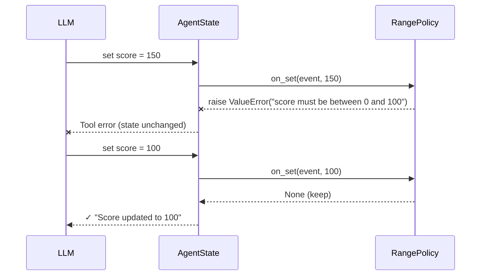

# Writing Custom Policies

A policy is a plain class implementing the `Policy` protocol. Subclass it,
implement **only the handlers you need**, and take configuration in
`__init__` — every handler you don't implement is skipped.

```python
from pyagentic.policies import Policy
from pyagentic.policies._events import (
    GetEvent, SetEvent, AppendEvent, CompileEvent,
)

class Policy(Protocol[T]):
    # sync — block and may transform or veto
    def on_get(self, event: GetEvent, value: T) -> T | None: ...
    def on_set(self, event: SetEvent, value: T) -> T | None: ...
    def on_append(self, event: AppendEvent, item: Any) -> Any | None: ...

    # async — runs before each LLM inference, result written back
    async def on_compile(self, event: CompileEvent, items: list) -> list | None: ...

    # async — fire-and-forget side effects after the operation
    async def background_get(self, event: GetEvent, value: T) -> None: ...
    async def background_set(self, event: SetEvent, value: T) -> None: ...
    async def background_append(self, event: AppendEvent, item: Any) -> None: ...
```

Three return conventions, everywhere:

| Handler returns | Meaning |
|---|---|
| a value | Replace the value/item/list with it |
| `None` | No change |
| *raises* | Veto — the write is aborted / the appended item is skipped |

---

## State policy examples

### Validation (veto by raising)

```python
class RangePolicy(Policy[int]):
    """Keep an int field within [min_val, max_val]."""

    def __init__(self, min_val: int, max_val: int):
        self.min_val, self.max_val = min_val, max_val

    def on_set(self, event: SetEvent, value: int) -> int | None:
        if not (self.min_val <= value <= self.max_val):
            raise ValueError(
                f"{event.name} must be between {self.min_val} and {self.max_val}"
            )
        return None


class GameAgent(BaseAgent):
    __instructions__ = "You run a text adventure."

    score: State[int] = spec.State(
        default=0,
        access="write",   # autogenerates a set_score tool
        policies=[RangePolicy(0, 100)],
    )
```

When the LLM calls `set_score(150)`, the policy raises, the write is aborted,
and the tool error propagates back to the LLM — which can retry with a valid
value:



### Transformation (return a replacement)

```python
class NormalizeTagPolicy(Policy[str]):
    """Store tags in a canonical form."""

    def on_set(self, event: SetEvent, value: str) -> str:
        return value.strip().lower().replace(" ", "-")
```

### Background persistence (side effects, non-blocking)

```python
import json, asyncio
from pathlib import Path

class JSONAuditPolicy(Policy):
    """Append every change to an audit file, off the hot path."""

    def __init__(self, filepath: str):
        self.filepath = Path(filepath)

    async def background_set(self, event: SetEvent, value) -> None:
        record = {
            "ts": event.timestamp.isoformat(),
            "field": event.name,
            "old": str(event.previous),
            "new": str(value),
        }

        def write():
            existing = (
                json.loads(self.filepath.read_text()) if self.filepath.exists() else []
            )
            existing.append(record)
            self.filepath.write_text(json.dumps(existing, indent=2))

        await asyncio.to_thread(write)
```

Background handlers run after the value is committed — they can't veto or
change it, and failures are logged rather than raised.

### List fields (mutation tracking)

Policies on list-typed fields fire on **in-place mutations** — appends run
`on_append` per item, other mutations run `on_set` over the whole list:

```python
class NoEmptyStrings(Policy):
    def on_append(self, event: AppendEvent, item) -> None:
        if isinstance(item, str) and not item.strip():
            raise ValueError("empty entries not allowed")


class NotesAgent(BaseAgent):
    __instructions__ = "You keep notes."

    notes: State[list] = spec.State(default_factory=list, policies=[NoEmptyStrings()])

# agent.notes.append("real note")  -> stored
# agent.notes.append("   ")        -> vetoed, list unchanged
```

---

## Message policy examples

Message policies attach via `__message_policies__` and receive the semantic
message types from `pyagentic.models.llm` — filter with `isinstance`.

### Redaction (transform on append)

Scrub secrets from tool output *before* it ever enters the context. The raw
history still holds the original for auditing.

```python
import re
from pyagentic.models.llm import ToolResultMessage

class RedactSecretsPolicy(Policy):
    """Mask API keys / bearer tokens in tool results."""

    PATTERN = re.compile(r"(sk-[A-Za-z0-9]{8,}|Bearer\s+\S+)")

    def on_append(self, event: AppendEvent, item):
        if isinstance(item, ToolResultMessage) and item.content:
            redacted = self.PATTERN.sub("[REDACTED]", item.content)
            if redacted != item.content:
                return item.model_copy(update={"content": redacted})
        return None
```

### Linked-agent response budget (targeted transform)

`AgentResultMessage` subclasses `ToolResultMessage`, so you can target linked
agents specifically and give them their own context budget:

```python
from pyagentic.models.llm import AgentResultMessage

class AgentResultBudgetPolicy(Policy):
    """Keep any single sub-agent response under a size budget."""

    def __init__(self, max_chars: int = 2000):
        self.max_chars = max_chars

    def on_append(self, event: AppendEvent, item):
        if isinstance(item, AgentResultMessage) and len(item.content or "") > self.max_chars:
            return item.model_copy(
                update={"content": item.content[: self.max_chars] + "…[truncated]"}
            )
        return None
```

### Context metrics (observe on compile, change nothing)

`on_compile` sees the whole context plus the last inference's token usage —
return `None` and it's a pure observer:

```python
import logging
from pyagentic.models.llm import ToolResultMessage

logger = logging.getLogger(__name__)

class ContextMetricsPolicy(Policy):
    """Log context size before every inference; warn near a budget."""

    def __init__(self, warn_at_tokens: int = 80_000):
        self.warn_at_tokens = warn_at_tokens

    async def on_compile(self, event: CompileEvent, items: list) -> None:
        tool_chars = sum(
            len(m.content or "") for m in items if isinstance(m, ToolResultMessage)
        )
        used = event.last_usage.input_tokens if event.last_usage else 0
        logger.info(
            f"context: {len(items)} messages, {tool_chars} tool chars, "
            f"{used} input tokens last call"
        )
        if used > self.warn_at_tokens:
            logger.warning(f"context nearing budget: {used}/{self.warn_at_tokens}")
        return None
```

### Custom compile transforms

`on_compile` may also rewrite the list — the result is written back, so the
effect persists across turns. Two rules to respect:

1. **Never orphan a tool call/result pair.** Providers reject a
   `ToolResultMessage` whose `ToolCallMessage` is missing (and vice versa).
   Stub content instead of deleting messages, or move your cut past the pair —
   see how the [built-in policies](built-in.md) handle this.
2. **Be idempotent.** Your policy runs before *every* inference; a second pass
   over already-processed context should return `None`.

```python
from pyagentic.models.llm import UserMessage

class KeepFirstUserTurnPolicy(Policy):
    """Always retain the original task statement when trimming."""

    def __init__(self, max_messages: int = 40):
        self.max_messages = max_messages

    async def on_compile(self, event: CompileEvent, items: list) -> list | None:
        if len(items) <= self.max_messages:
            return None
        first_user = next((m for m in items if isinstance(m, UserMessage)), None)
        tail = items[-(self.max_messages - 1):]
        if first_user is None or first_user in tail:
            return tail
        return [first_user] + tail
```

---

## Rules of the road

### Policies must be stateless

Policy instances are attached at **class-definition time** and shared across
all agent instances and forks. Configuration in `__init__` is fine; per-agent
mutable state on the policy is a bug (two agents would share it).

Derive anything per-agent from what the event gives you:

- the list contents themselves (e.g. check for an existing stub or
  `CompactionSummaryMessage` marker instead of remembering "already ran")
- `event.state` for state fields, `event.last_usage` for token counts

### Ordering

Policies run in declaration order, each seeing the previous one's output —
validate first, transform second, side effects last:

```python
score: State[int] = spec.State(
    default=0,
    policies=[
        RangePolicy(0, 100),        # 1. validate
        # transformation would go here
        JSONAuditPolicy("audit.json"),  # 2. persist (background)
    ],
)
```

The first exception in a sync pipeline aborts the operation; later handlers do
not run.

### Keep sync handlers fast

`on_get`/`on_set`/`on_append` block the operation. Anything that does I/O
belongs in a `background_*` handler, or in `on_compile` (which is async and
runs once per inference rather than once per access).

---

## Testing your policies

Events are plain dataclasses and handlers are plain methods — unit-test them
directly, no agent required:

```python
import pytest
from pyagentic.policies._events import AppendEvent
from pyagentic.models.llm import ToolResultMessage

def test_redaction_masks_keys():
    policy = RedactSecretsPolicy()
    msg = ToolResultMessage(tool_call_id="c1", name="fetch", content="key=sk-abcdef123456")

    result = policy.on_append(AppendEvent(name="messages", value=msg), msg)

    assert "[REDACTED]" in result.content
    assert "sk-" not in result.content
```

For end-to-end behavior, run an agent against the mock provider
(`model="_mock::test-model"`) and assert on `agent.state._context` (what the
LLM saw) versus `agent.state._messages` (what actually happened):

```python
@pytest.mark.asyncio
async def test_budget_policy_in_agent():
    class _Agent(BaseAgent):
        __instructions__ = "test"
        __message_policies__ = [AgentResultBudgetPolicy(max_chars=100)]

    agent = _Agent(model="_mock::test-model", api_key="k")
    await agent.run("hello")
    ...
```
