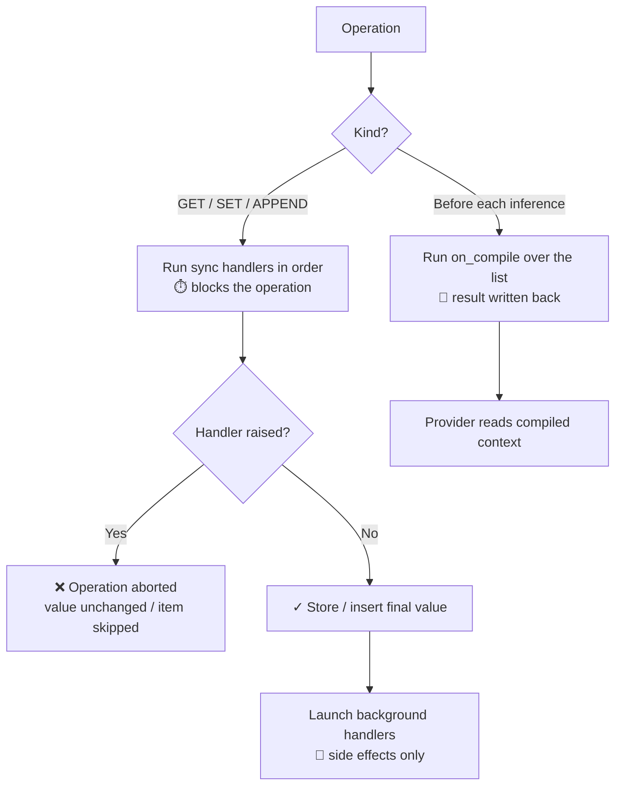

# Policies

Policies are hooks that react to your agent's data as it moves — state fields
being read and written, and messages entering the conversation context. They
let you validate, transform, redact, persist, and bound data **declaratively**,
without cluttering tool implementations or subclassing framework internals.

One protocol covers both surfaces:

- **State policies** guard a single typed state field (validate a score, trim a
  string, persist changes).
- **Message policies** manage the conversation context sent to the LLM (clip
  huge tool outputs, evict stale results, summarize old history) — this is how
  you prevent context explosion on long-running agents.

```python
from pyagentic import BaseAgent, State, spec
from pyagentic.policies import ToolEvictionPolicy, CompactionPolicy

class SupportAgent(BaseAgent):
    __instructions__ = "You help customers with {{ product }}."

    # Message policies: keep the LLM context bounded
    __message_policies__ = [
        ToolEvictionPolicy(keep_last_n=5),
        CompactionPolicy(max_input_tokens=80_000),
    ]

    # State policy: guard a single field
    ticket_priority: State[int] = spec.State(
        default=3,
        policies=[RangePolicy(min_val=1, max_val=5)],  # custom -> see Writing Custom Policies
    )
```

This section:

- **Overview (this page)** — the mental model: events, handlers, and the two attachment points.
- **[Built-in Policies](built-in.md)** — the ready-to-use context-management policies.
- **[Writing Custom Policies](custom.md)** — the protocol, real examples, testing.

---

## Why use policies?

Without policies, every tool that touches a field repeats the same validation
and side-effect code — and nothing at all protects the message context, which
grows without bound as tools return output.

**Without policies**

```python
@tool("Award combat points")
def defeat_enemy(self, points: int = 10):
    new_score = self.combat_score + points
    if not (0 <= new_score <= 100):          # repeated in every tool...
        raise ValueError("Score must be 0..100")
    self.combat_score = new_score
```

**With policies**

```python
combat_score: State[int] = spec.State(
    default=0,
    policies=[RangePolicy(0, 100)],
)

@tool("Award combat points")
def defeat_enemy(self, points: int = 10):
    self.combat_score += points   # intent only; the policy enforces bounds
```

The same logic applies to context: instead of every tool worrying about how big
its output is, one `ToolOutputClipPolicy` on the class guards them all.

---

## The two attachment points

### State fields

Pass policies to `spec.State`. They fire whenever the field is read or written —
whether by your code, a tool body, or the autogenerated `get_*`/`set_*` tools.

```python
class GameAgent(BaseAgent):
    __instructions__ = "You run a text adventure."

    score: State[int] = spec.State(default=0, policies=[RangePolicy(0, 100)])
```

**List-valued fields get mutation tracking.** A policied list field is wrapped
in a `PolicyList`, so in-place mutations fire policies too:

- `append` / `extend` / `insert` / `+=` → `on_append` per item
- `[i] = x` / `del` / `remove` / `pop` / `clear` → `on_set` over the whole list

```python
notes: State[list] = spec.State(default_factory=list, policies=[NoEmptyStrings()])
# agent.notes.append("")  -> vetoed by the policy
```

### The message context

Declare `__message_policies__` on the agent class. These policies fire for
every message entering the context (user turns, assistant replies, tool calls
and results) and once more over the whole list right before each LLM call.

```python
class ResearchAgent(BaseAgent):
    __instructions__ = "You research topics using tools."
    __message_policies__ = [
        ToolOutputClipPolicy(max_chars=8000),
        ToolEvictionPolicy(keep_last_n=5),
    ]
```

`__message_policies__` is inherited by subclasses and composes through
`AgentExtension` mixins. Forked agents (linked-agent calls) keep the policies
with a fresh, empty history.

### Dual history: raw log vs. working context

The state keeps **two** message lists, so policies can be aggressive without
destroying information:

| List | What it is | Policies |
|---|---|---|
| `state._messages` (`state.raw_messages`) | Raw append-only log of everything that happened | Never touched |
| `state._context` (`state.messages`) | Working context providers actually send | Shaped by `on_append` and `on_compile` |

Because compile results are **written back** to the working context, effects
persist: `CompactionPolicy` summarizes once per threshold crossing instead of
re-summarizing every turn, and the context keeps stable prefixes for provider
prompt caching.

Messages in the context are semantic types you can filter with `isinstance` —
`UserMessage`, `AssistantMessage`, `ToolCallMessage`, `ToolResultMessage`,
`AgentCallMessage`/`AgentResultMessage` (linked-agent calls; subclasses of the
tool types), and `CompactionSummaryMessage`.

---

## Events

Every handler receives an event describing what happened, plus the value being
processed.

**`GetEvent`** — a state field is read

```python
@dataclass
class GetEvent:
    name: str           # Field name being accessed
    value: Any          # Current value
    timestamp: datetime
```

**`SetEvent`** — a state field is written (or a policied list is mutated in place)

```python
@dataclass
class SetEvent:
    name: str           # Field name being modified
    previous: Any       # Value before the change
    value: Any          # New value being set
    timestamp: datetime
```

**`AppendEvent`** — an item is appended to a policied list field or the message context

```python
@dataclass
class AppendEvent:
    name: str           # Field name, or "messages" for the message context
    value: Any          # The item being appended
    timestamp: datetime
```

**`CompileEvent`** — fired right before each LLM inference, over a whole list

```python
@dataclass
class CompileEvent:
    name: str                     # Field name, or "messages"
    value: list                   # The list being compiled
    provider: LLMProvider         # The provider about to be called
    last_usage: UsageInfo | None  # Token usage from the previous inference
    system_message: str | None    # Rendered system prompt (read-only)
    state: _AgentState            # The owning state
    timestamp: datetime
```

---

## Handler semantics

A policy implements only the handlers it needs; missing handlers are skipped.

* **Synchronous (`on_get`, `on_set`, `on_append`)**

    * Run **before** the value is returned/stored/inserted and **block** the operation.
    * May **transform** by returning a replacement, or return `None` for no change.
    * May **veto** by raising — the operation is aborted (for `on_append`, the
      item is skipped; for the message context it stays in the raw log).
    * Run in declaration order; each handler sees the previous one's output.

* **Async compile (`on_compile`)**

    * Runs right **before every LLM inference**, receiving the whole list.
    * May return a transformed list; the result is **written back**.
    * Async by design — a compile policy can itself call the LLM
      (see [`CompactionPolicy`](built-in.md#compactionpolicy)).

* **Background (`background_get`, `background_set`, `background_append`)**

    * Run **after** the operation completes; fire-and-forget.
    * For **side effects only**: logging, metrics, notifications, persistence.
    * Cannot veto or change an already-committed value.

### Execution flow



---

## Where to go next

- **[Built-in Policies](built-in.md)** — clip, evict, window, and compact the
  message context without writing any code.
- **[Writing Custom Policies](custom.md)** — the protocol in depth, with
  working examples for validation, redaction, budgets, and metrics.
